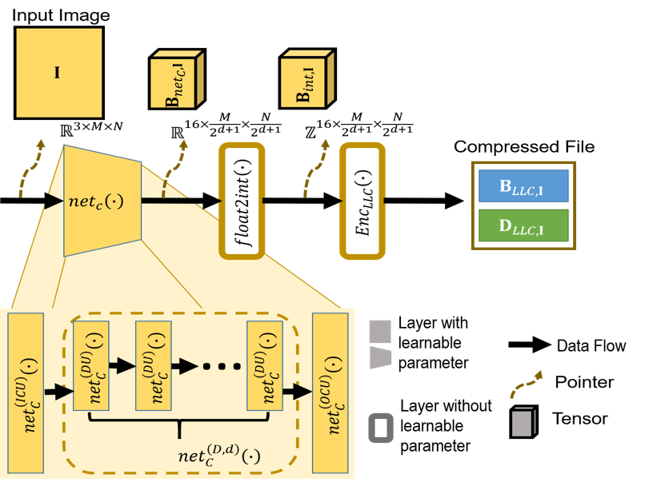

# Semantic Segmentation of Driving Videos on Learning based Image Compression
### Official implementation of the paper "Kakaiya, Ravi, et al. (2023) “Exploiting Richness of Learned Compressed Representation of Images for Semantic Segmentation.”  IEEE International Conference on Multimedia and Expo 2023 "

Autonomous vehicles and Advanced Driving Assistance Systems (ADAS) have the potential to radically change the way we travel. Many of such vehicles currently rely on segmentation and object detection algorithms to detect and track objects around its surrounding. The data collected from the vehicles are often sent to cloud servers to facilitate continual/life-long learning of these algorithms. Considering the bandwidth constraints, the data is compressed before sending it to servers, where it is typically decompressed for training and analysis. In this work, we propose the use of a learning-based compression Codec to reduce the overhead in latency incurred for the decompression operation in the standard pipeline. We demonstrate that the learned compressed representation can also be used to perform tasks like semantic segmentation in addition to decompression to obtain the images. We experimentally validate the proposed pipeline on the Cityscapes dataset, where we achieve a compression factor up to 66× while preserving the information required to perform segmentation with a dice coefficient of 0.84 as compared to 0.88 achieved using decompressed images while reducing the overall compute by 11%.


<p align="center">


<p>
<p align="center">
			    	Overview of proposed method
		<p>

​


>**Paper** : Kakaiya, Ravi, et al. (2023) “Exploiting Richness of Learned Compressed Representation of Images for Semantic Segmentation.”  IEEE International Conference on Multimedia and Expo 2023  . </br> 

> Access the paper via the [Arxiv link]( https://arxiv.org/abs/2307.01524)
​


<!---
BibTeX reference to cite, if you use it:

​

```bibtex
@INPROCEEDINGS{9175649,

  author={Sathish, Rakshith and Sathish, Rachana and Sethuraman, Ramanathan and Sheet, Debdoot},

  booktitle={2020 42nd Annual International Conference of the IEEE Engineering in Medicine & Biology Society (EMBC)}, 

  title={Lung Segmentation and Nodule Detection in Computed Tomography Scan using a Convolutional Neural Network Trained Adversarially using Turing Test Loss}, 

  year={2020},

  volume={},

  number={},

  pages={1331-1334},

  doi={10.1109/EMBC44109.2020.9175649}}

```
-->
## Dataset used

The Cityscapes dataset was used for our training and evaluation. It has 5,000 images of size 1,024×2,048 with polygon annotations for 34 classes. We use the validation set provided in the dataset as our held-out test set and the training set is divided into training and testing datasets in the ratio of 80:20.

 >Dataset download page: [Click the link.](https://www.cityscapes-dataset.com/)
<!---
>**Note**: Systematically sampled slice numbers/images to be used are given in the repository inside the data preparation folder.
-->

​

## Code and Directory Organization


	Exploiting-Richness-of-Learned-Compressed-Representation/
	  media/
	  src/
		compression/
        		utils/
				dataloader.py
   				model.py

	      		infer_and_save.py
	      		train.py
  		
  
      	data_preperation/
      			generation_of_patches.py
		
  		sample_images/

     	segmentation/
      		utils/
				dataloader.py
   				model.py

	        	infer_and_save.py
			train.py
	LICENSE
	README.md


## System Specifications

The code and models were tested on a system with the following hardware and software specifications.

- Ubuntu* 16.04

- Python* 3.6

- NVidia* GPU for training

- 16GB RAM for inference


## Data Preparation

Follow the below steps to prepare and organize the data for training.

> Details about the arguments being passed and their purpose is explained within the code.
​
> Make sure the dataset has been adequately downloaded and extracted before proceeding.

1. The compression model ( $net_C( . ) - net_D( . )$ ) for all baselines and the proposed method are trained with patches of 256×256, and segmentation models ( $net_{seg}( . ), net_{seg, D'}( . )$ ) were trained using non-overlapping patches of size 840×840, respectively, which were extracted from the training set without any overlapping.

	
## Training
> Details about the arguments being passed and their purpose is explained within the code. <!---To see the details run `python train_network.py -h` -->

​The compression-decompression and the segmentation training routine are explained adequately in the paper. In the compression block, weights are updated for both  $net_C( . ) - net_D( . )$ with respect to gradients calculated using the reconstruction error between the Input Image and the decompressed Image. For the segmentation model, we use the dual graph convolutional neural network (DGCN) architecture proposed to perform segmentation. The segmentation network $net_{seg}(·)$ consists of a backbone network that provides a feature map X and dual graph convolutional layers, which effectively and efficiently models contextual information for semantic segmentation. We use ResNet-50 architecture as our backbone network.
The compression model $net_C( . ) - net_D( . )$ was trained for 100 epochs with Adam as optimizer using a step learning rate scheduler with an initial learning
rate of $1 × 10^{-2}$, step size of 10 and multiplication factor γ of 0.75. The segmentation decoder ($net_{seg,D′}$) was trained for 40,000 iterations using SGD as the optimizer with an initial learning rate of $1×10^{-3}$. Mean square error and cross-entropy loss were chosen as loss functions for compression and segmentation, respectively.

<p align="center">
 

</p>
<p align="center">
			    	Compressor-Decompressor Architecutre
		<p>
<p align="center">


<p>
<p align="center">
			    	Segmentation Decoder Architecture
		<p>


​

## Evaluation


> Details about the arguments being passed and their purpose is explained within the code.

​
The quality of compression in terms of SSIM and pSNR at varying network depth or the number of digest units (d) and bit length (n) is shown in the paper. It can be observed that for all values of d in the range 1 to 3, we do not observe significant degradation in the quality of the decompressed image. For values of n less than 6, we can observe a noticeable drop in performance. Further, we can observe that with a learnable compression codec, we can compress the images up to 200× without a significant drop in performance for a bit length of 8.
In the case of the segmentation model, dice coefficient values for the baselines and $net_{seg,D}(·)$, which is trained using compressed representations, are reported in Table I. The results indicate that $net_{seg,D}(·)$ performs similarly to BL 3 and BL 4 in terms of dice coefficient. This suggests that the compressed representations produced by $net_C(·)$ contain significant semantic information that can be leveraged for other image analysis tasks, even though $net_C(·)$ was not explicitly trained for this purpose. Further, it can be observed that increasing the value of d, which results in a deeper network and higher compression factor, results in poorer reconstruction from the compressed representation owing to loss of information

## Pre-trained Models
Pretrained models for inference are available [here](http://kliv.iitkgp.ac.in/projects/miriad/model_weights/dl4c/model_weights.zip). 

## Sample Images for inference
The [sample_images](src/sample_images) folder under src contains images for you to test  out.
​
## Sample Output
A comparison with the ground truth, baselines, and model outputs is shown below.


## Acknowledgement

**Principal Investigators**

<a href="https://www.linkedin.com/in/debdoot/">Dr Debdoot Sheet</a></a></br>
Department of Electrical Engineering,</br>
Indian Institute of Technology Kharagpur</br>
email: debdoot@ee.iitkgp.ac.in


<a href="https://www.linkedin.com/in/ramanathan-sethuraman-27a12aba/">Dr Ramanathan Sethuraman</a>,</br>
Intel Technology India Pvt. Ltd.</br>
email: ramanathan.sethuraman@intel.com


**Contributors**
<br>
The codes/model were contributed by:
<br>

<a href="https://github.com/ravikakaiya"> Ravi Kakaiya</a>,</br>
Department of Electrical Engineering,</br>
Indian Institute of Technology Kharagpur</br>
email: ravijk8299@kgpian.iitkgp.ac.in</br>
Github username: ravikakaiya


<a href="https://github.com/Rakshith2597"> Rakshith Sathish</a>,</br>
Advanced Technology Development Center,</br>
Indian Institute of Technology Kharagpur</br>
email: rakshith.sathish@kgpian.iitkgp.ac.in</br>
Github username: Rakshith2597


<a href="https://github.com/PragyadiptaAdhya"> Pragyadipta Adhya</a>,</br>
Department of Electrical Engineering,</br>
Indian Institute of Technology Kharagpur</br>
email: pragyadipta.adhya@kgpian.iitkgp.ac.in</br>
Github username: PragyadiptaAdhya 
​

## References

<div id="densenet">
<a href="#abs">[1]</a> Ravi Kakaiya, Rakshith Sathish, Debdoot Sheet, Ramananthan Sethuraman "Exploiting Richness of Learned Compressed Representation of Images for Semantic Segmentation" .  </a> 

</div>
